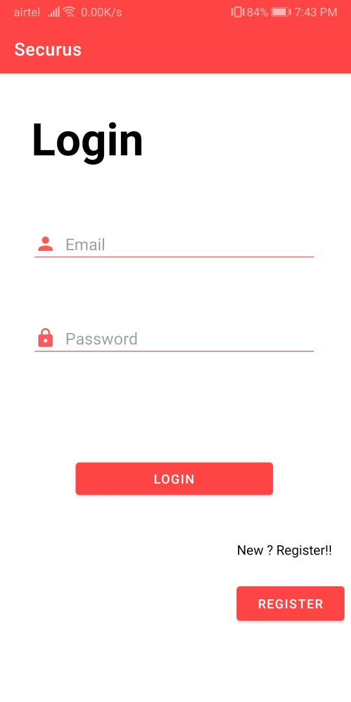
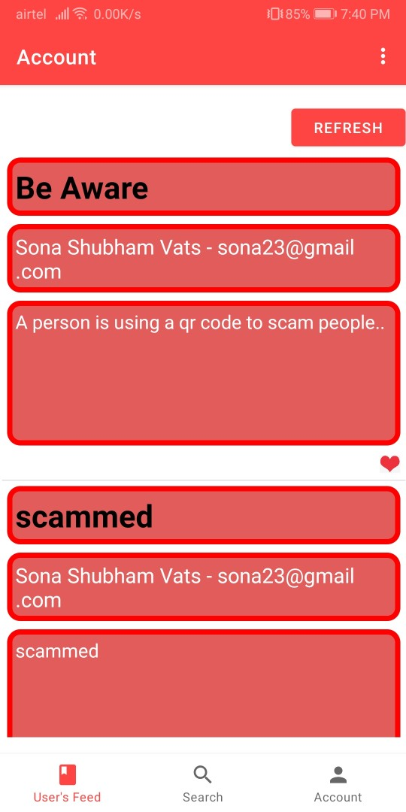
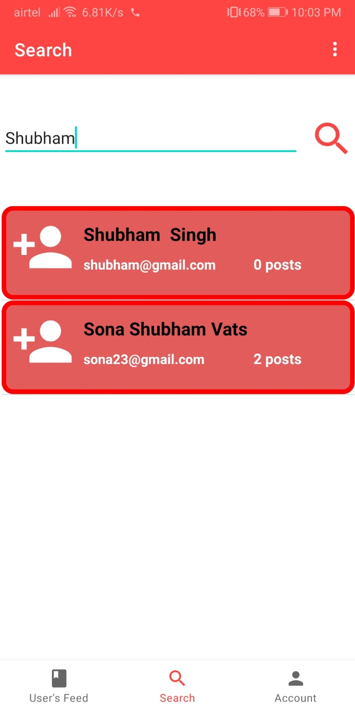
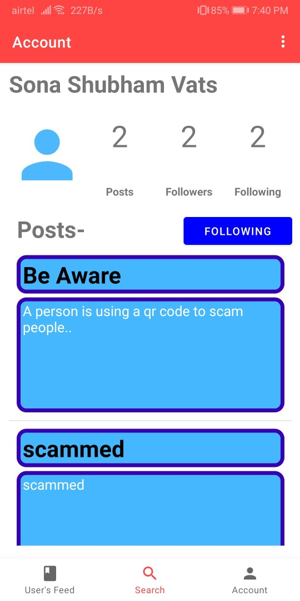
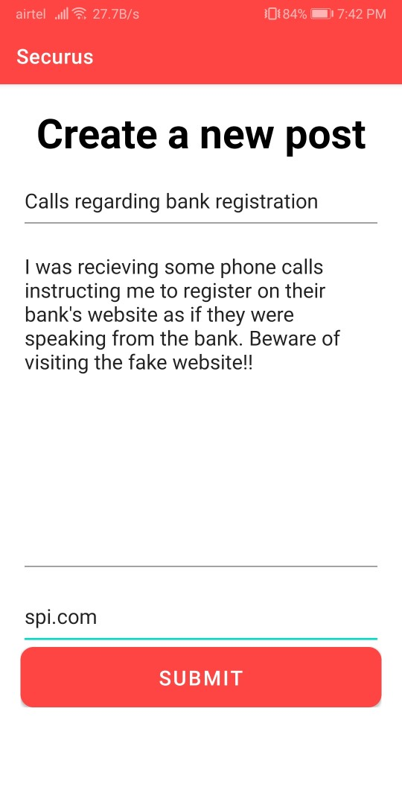
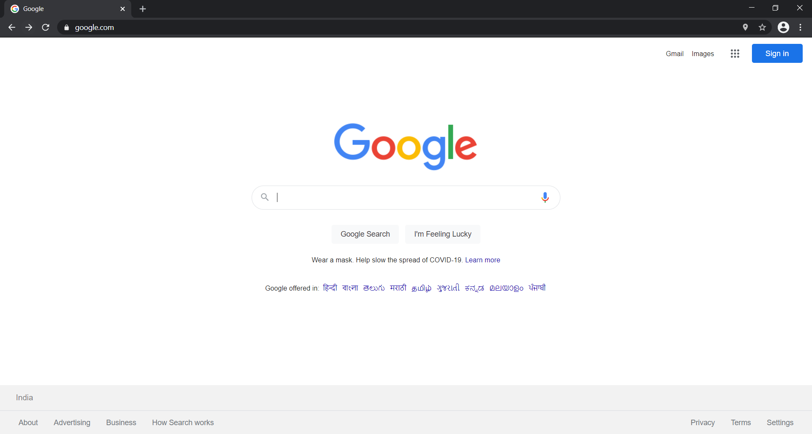
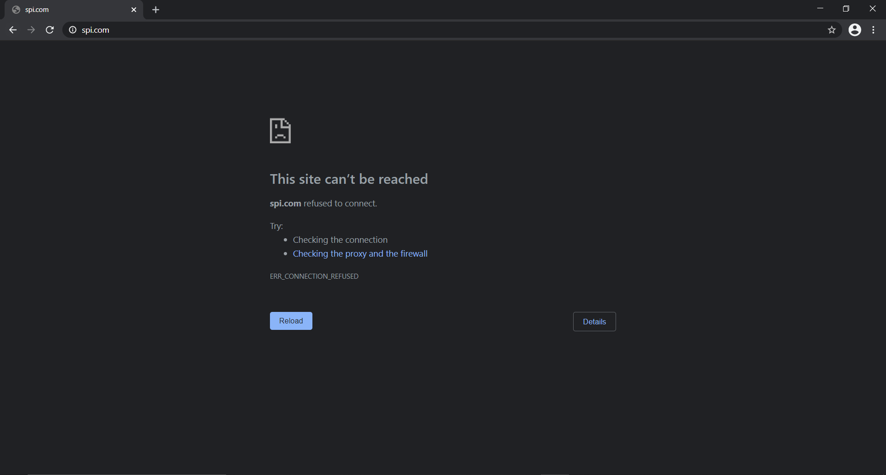

# Securus Cyber Blog

The Securus cyber blog project aims to tackle cyber attacks and cyber threats and provide new users the ease to share their thoughts and learn more about these topics. Not only it provides its users with valueable information, but also uses this information to protect people from known threats and attacks without them knowing it.

## Android application - Securus

This idea is implemented in 2 modules, one of which is the android application which aims to connect users, share their thoughts and ask their queries. It runs on Firebase servers and uses Firestore to store user information and provide its best use to everyone.

### Authentication:

New users can easily register, and already existing users can log in with their email ids. Each user's data is maintained and user's recieve personlised information on their handset.

 

### Account:

Each user gets posts directly on their <b>User's Feed</b> related to people they follow. They can view what's happening around them, and stay updated. Users can view their profile in <b>Account</b> section with their account details.

 

### Community:

Creating a community based app, connectivity is the most important feature for the project, users can find their friends and other users, view their profile and posts, and follow them for future updates.

 

### Sharing stories:

As a part of the community, it is possible for users to share their own stories which can be seen by their followers and viewers. This can be accomplished from Creating a new post in <b>Accounts</b> section. Users can share their stories which would be visible on their follower's feed.

 

The to do list for this app's update consists of setting up the service to verify the posts, and identify their threat levels and maintain the python bot accordingly.

## Python Bot - Salvus

The python based safe web browser is the second module of the project. Taking the information recieved from users, it acts on that data and takes specific decisions to keep all the users safe from the threats reported. The python bot updates it data directly from the securus database and blocks all the reported websites to keep the users secure.

### Safe browser

The browser can be opened by the Salvus.exe file. This, using chrome webdriver, opens a browser which is connected with the python script and uses it to block possibly threat containing websites.

As an example, website "spi.com" was registered as a threat by a user on the Securus app, so this website is not reachable. Similarly with the information available, we aim to secure these threats and provide a safe working environment for everyone.

