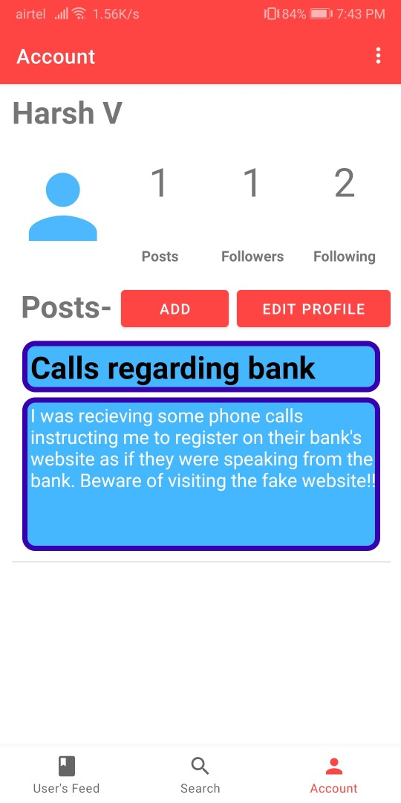

# Securus Cyber Blog

The Securus cyber blog project aims to tackle cyber attacks and cyber threats and provide new users the ease to share their thoughts and learn more about these topics. Not only it provides its users with valueable information, but also uses this information to protect people from known threats and attacks without them knowing it.

## Android application

This idea is implemented in 2 modules, one of which is the android application which aims to connect users, share their thoughts and ask their queries. It runs on Firebase servers and uses Firestore to store user information and provide its best use to everyone.

### Authentication:

New users can easily register, and already existing users can log in with their email ids. Each user's data is maintained and user's recieve personlised information on their handset.

 

### Authentication:

 

### Authentication:

 

### Authentication:

 
